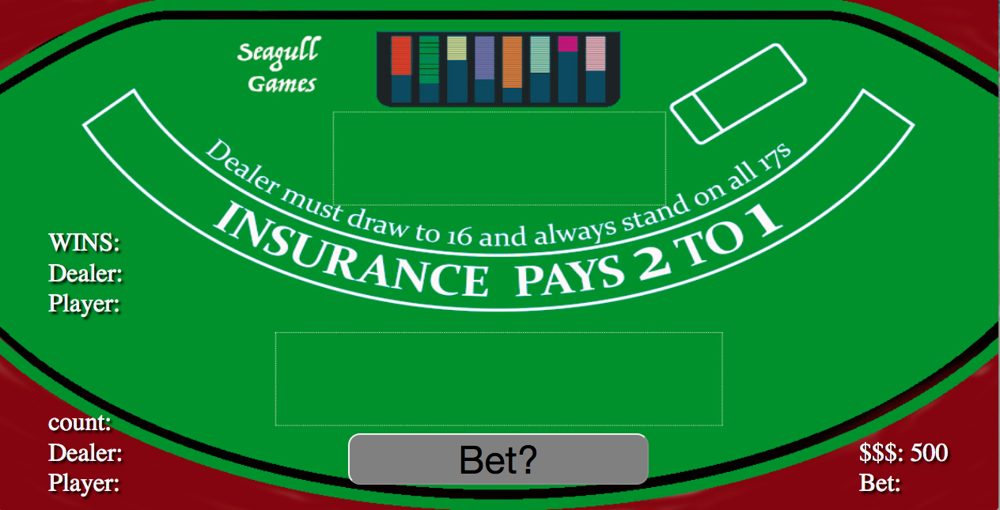
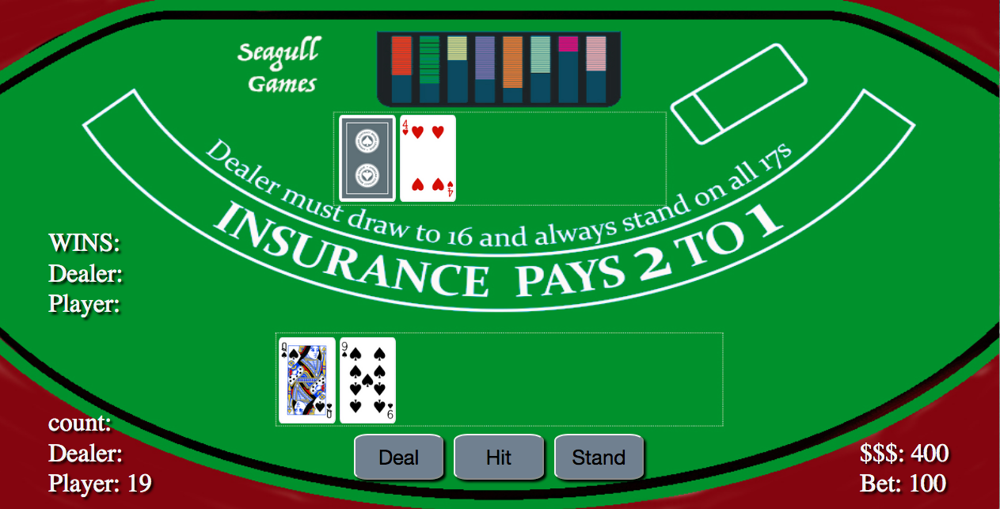
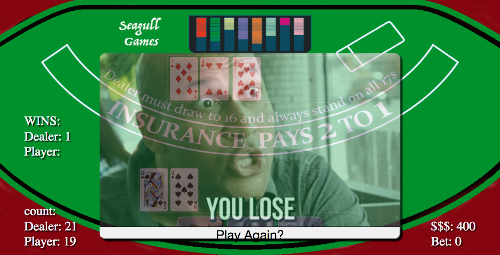

<h1>Black Jack</h1>
Play the game at seagull7.github.io

<h2>Description</h2>
This browser based game allows the user to play the classic card game, BlackJack (or 21). The game allows the user to play against a dealer and encompasses all of the basics of the game including bets, hits, chips, and win counts.

<h2>Technologies Used</h2>
<li>HTML5</li>
<li>CSS3</li>
<li>JavaScript</li>
<li>jQuery</li>

<h4>Basic Table:</h4>

<h4>Cards Dealt:</h4>

<h4>The House Always Wins in The End:</h4>

